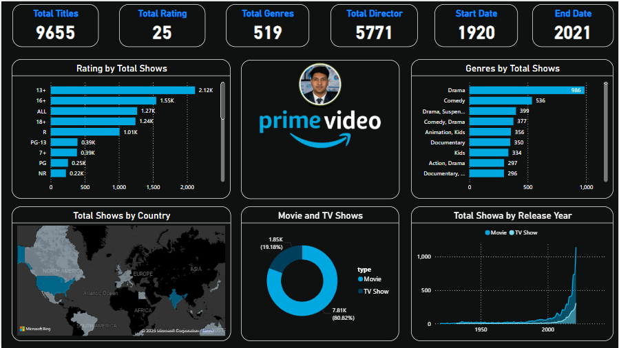

# 🎬 Amazon Prime Video Content Analysis Dashboard

---

## Overview

Dive deep into **Amazon Prime Video's** vast content universe with this **interactive Power BI dashboard**. Analyze a rich library of **9,655 titles** spanning **over a century (1920–2021)** to uncover insightful trends, genre dynamics, and audience ratings.

Whether you're a data analyst, content strategist, or entertainment enthusiast, this dashboard equips you with a powerful lens to visualize and explore Amazon Prime’s content landscape like never before.

---

## 🔥 Key Highlights

| **Metric**            | **Value**            |
|-----------------------|----------------------|
| **Total Titles**       | 9,655                |
| **Unique Genres**      | 519                  |
| **Distinct Directors** | 5,771                |
| **Content Period**     | 1920 – 2021          |

---

## ✨ Features & Capabilities

- **Data-Rich Insights**  
  Analyze a comprehensive dataset encompassing movies and TV shows, enriched with ratings, genres, release years, and more.

- **Powerful Interactive Filters**  
  Drill down by **content rating**, **genre(s)**, **country of origin**, and **content type** (Movie/TV Show).

- **Temporal Trend Analysis**  
  Observe production trends and content volume changes by decade with smooth area and line charts.

- **Genre Combination Analytics**  
  Discover dominant and niche genre pairings driving viewer interest on the platform.

---

## 📊 Visual Breakdown

### 1. Content Rating Distribution  
- Visualize title counts across rating categories (e.g., 13+, 16+, ALL, 18+).  
- Dominant ratings include:  
  - **13+** (1,530 titles)  
  - **16+** (1,270 titles)  
  - **ALL** (1,240 titles)

### 2. Genre Popularity & Combinations  
- Donut charts revealing genre shares:  
  - **Drama**: 34%  
  - **Comedy**: 33%  
  - Top genre combos:  
    - Drama & Surgeon (39%)  
    - Comedy & Drama (37%)

### 3. Content Type Composition  
- Pie chart depicting Movies vs. TV Shows:  
  - **Movies** dominate with 7,810 titles (80.82%)  
  - **TV Shows** account for 1,850 titles (15.19%)

### 4. Release Trends Over Time  
- Dynamic area charts tracking content output from 1950 through 2020.  
- Seamless toggling between movies and TV shows reveals distinct production cycles.

---

## 🚀 How to Use

1. **Customize your view** by applying filters on ratings, genres, countries, or content types.  
2. **Interact with visuals** by hovering or clicking for granular data insights.  
3. **Analyze temporal shifts** to detect evolving content strategies and market trends.

---

## 📂 Data & Dashboard Files

Download the dashboard and dataset directly from the GitHub repository:

- **Power BI Dashboard File (.pbix)**  
  [amazon_prime.pbix](https://github.com/RabbiTheAnalyst/Amazon_Prime_Dashboard_Analysis/blob/main/amazon_prime.pbix)

- **Amazon Prime Video Titles Dataset (.csv)**  
  [amazon_prime_titles.csv](https://github.com/RabbiTheAnalyst/Amazon_Prime_Dashboard_Analysis/blob/main/amazon_prime_titles.csv)

---

## 💡 Why This Dashboard?

This dashboard is a powerful toolkit for content analysts, marketers, and data enthusiasts aiming to:

- Understand content diversity and audience targeting  
- Monitor release frequency and historical trends  
- Identify genre popularity and hybrid trends  
- Support data-driven content strategy and decision-making  

---

## 🙏 Thank You for Exploring!

Made with passion and precision to unlock the stories behind the screens of Amazon Prime Video.

---

*For feedback, collaboration, or queries, feel free to reach out!*
